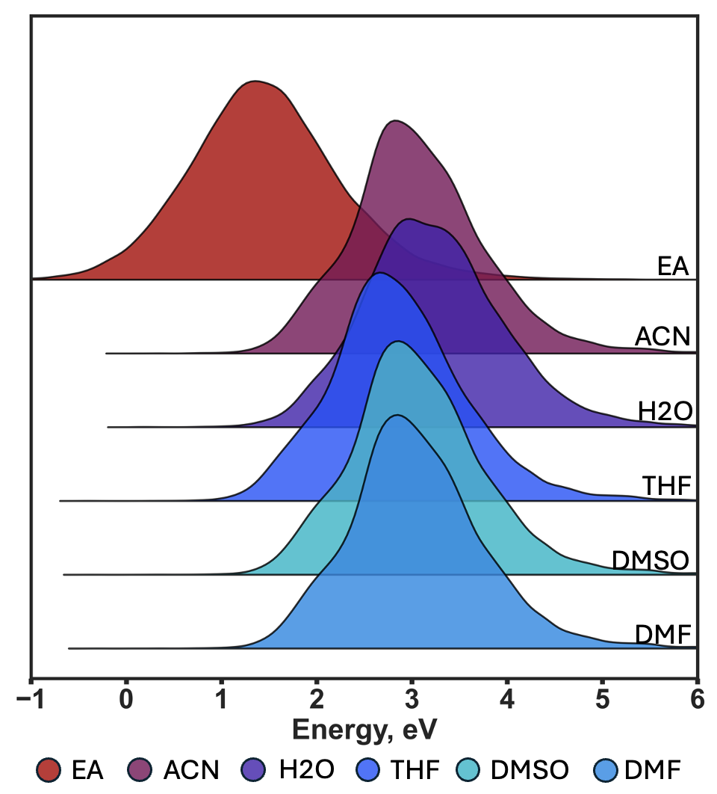

# ReSolved Dataset (Reduction in Solvents)

The **ReSolved** dataset is a curated benchmark designed to support machine learning and computational chemistry efforts focused on predicting redox behavior of organic molecules in solution. It provides **DFT-computed electron affinities (EA)** and **one-electron reduction potentials (Ered)** and , **DFT-optimised geometries** for nearly 20k molecules across five solvents. 

## Dataset Overview

- **Total molecules**: 19,785  
- **Solvents**:  
  - Acetonitrile (ACN)  
  - Water (H₂O)  
  - Tetrahydrofuran (THF)  
  - Dimethyl sulfoxide (DMSO)  
  - Dimethylformamide (DMF)  
- **Properties included**:  
  - Electron affinity (EA)  
  - One-electron reduction potential (Ered) at 25°C

## Source and Construction

Molecules in ReSolved were selected from:

- OMEAD (Organic Materials for Energy Applications Database) (doi.org/10.1016/j.ensm.2021.10.029)
- REDOX dataset(doi.org/10.1063/5.0151122), comprising:
  - Organic radicals (e.g., nitroxyl, phenoxyl, galvinoxyl)
  - Carbonyl compounds (quinones, carboxylates, phenazine-derived radicals)
  - Cyanides

All electronic properties were computed using **DFT at the M06-2X/def2-TZVPD** level of theory with the **SMD implicit solvent model**.

## Citation

If you use this dataset in your research, please cite the associated publication: TBA